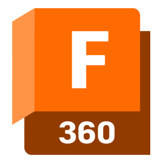
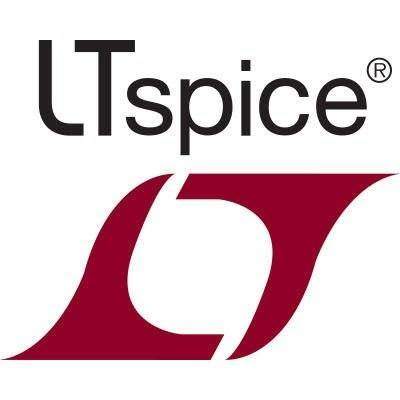
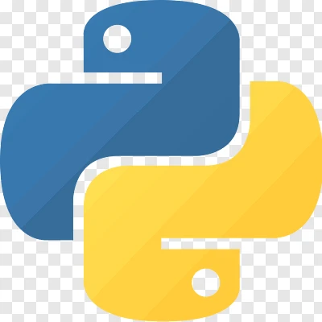
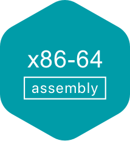
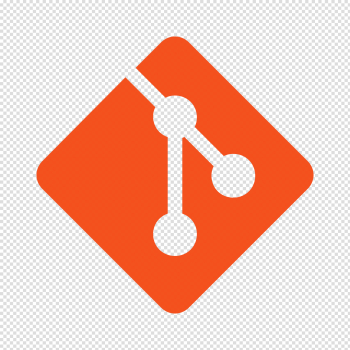
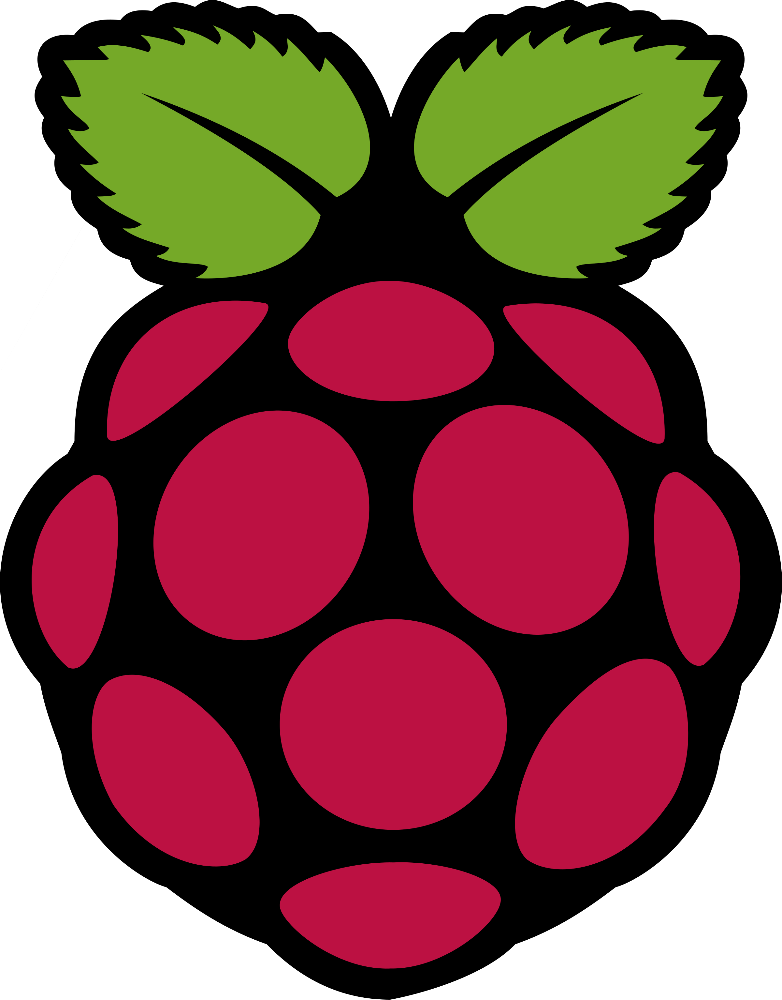
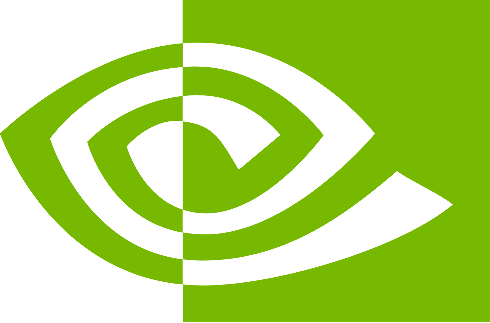

## Software, Languages, & Tools 👨‍💻👷‍♂️🛠️

### General-Use Software

  
  
  
  
  
  

### Programming & Markup Languages

  
  
  
  
  
  
  
  

### Hardware Description & Low-Level Languages

  
  
  
  

### Software Development

  
  
  
  
  

### Embedded Systems & Microcontrollers

  
  
  

### Personal Stats (Credit: @anuraghazra)

<!--
**zichungao88/zichungao88** is a ✨ _special_ ✨ repository because its `README.md` (this file) appears on your GitHub profile.

Here are some ideas to get you started:

- 🔭 I’m currently working on ...
- 🌱 I’m currently learning ...
- 👯 I’m looking to collaborate on ...
- 🤔 I’m looking for help with ...
- 💬 Ask me about ...
- 📫 How to reach me: ...
- 😄 Pronouns: ...
- ⚡ Fun fact: ...
-->
